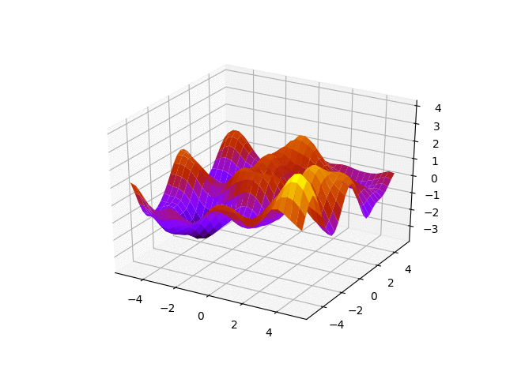

#  Transforming Gaussian Processes With Normalizing Flows

This is the repository for the work Transforming Gaussian Processes With Normalizing Flows published at AISTATS 2021 (https://arxiv.org/abs/2011.01596)



## Installation

General library dependencies:

* libspatialindex (https://libspatialindex.org/): 

```bash
sudo apt-get install libspatialindex-dev -y
```

##### Environment

Install python 3.7 environment. First clone the repository. Then, to install a python environment using conda and assuming that `$conda` is the root to the conda install directory (e.g `/usr/local/anaconda3/bin/conda`)  you must type:

```bash
$conda create -y -n DSP_py3.7_torch1.5 python=3.7
$conda activate DSP_py3.7_torch1.5
pip install -r requirements.txt
```

## Tutorial

I have uploaded a simplified version version of this code, running on a toy example here https://github.com/jmaronas/Machine.Learning.Models.pytorch/tree/master/models/Gaussian_Processes/SVGP_TGP . If you just want to understand the machinery behind the TGP, avoiding all the wrapping done to be able to run many different experiments as in the paper, then this simplified code should be much more helpfull.

## Reproducibility

We provide the minimal code to reproduce some of the experiments performed. The reason is to make the code easier to track. If you want more information about some parts of the implementation  feel free to email to [jmaronasm@gmail.com](jmaronasm@gmail.com). 

The dataset partitions used are provided in the dataset folder. They are given through pickle objects, e.g in `./code/datasets/regression/uci/`. For an example on how to load a particular split you can check the line `data_loaders, data_config = return_dataset(dataset_name, batch_size, use_validation = None, seed = train_test_seed, options = options)` in the  `main.py` file. Some of the datasets are not kept in the repository due to size constraints, but we provide some files to automatically download them. If you are interested in running some datasets that are not directly provided you can send an email and we will kindly point you to the script that performs the download (e.g in the Airline dataset).

If you wish to compare your work to this work using our data splits, then you can just use our pickle objects with the UCI partitions in your work and then email to [jmaronasm@gmail.com](jmaronasm@gmail.com) asking for the excel books where we keep the results of the paper. We will be happy to share our runs directly with you so that you do not have to re-run our model and just directly plug-in our results into your research.

The results from the camera ready were obtained in Ubuntu 20 machines using Nvidia RTX 2080 GPUs.

To run the example code just go into `code` folder and execute:

```
python main.py --model {MODEL} --dataset {DATASET} --train_test_seed_split {SPLIT} --num_inducing {NUM INDUCING}
```

with the following arguments:

* `{MODEL}`: can be `SVGP`, `TGP` or `ID_TGP` (input dependent TGP)
* `{SPLIT}` : a number in the range `[1,10]`
* `{DATASET}`: can be either `power` or `boston`
* `NUM INDUCING`: number of inducing points to run


##### Results with code above

These are some of the results obtained with the above code in an Ubuntu 16 machine using a GTX-980:

| Model  | Inducing Points | NLL   | RMSE  |
| :----- | --------------- | ----- | ----- |
| SVGP   | 100             | 2.798 | 3.961 |
| TGP    | 100             | 2.795 | 3.952 |
| PE TGP | 100             | 2.712 | 3.592 |
| BA TGP | 100             | 2.672 | 3.533 |
| SVGP   | 5               | 2.862 | 4.229 |
| TGP    | 5               | 2.861 | 4.228 |
| PE TGP | 5               | 2.744 | 3.732 |
| BA TGP | 5               | 2.725 | 3.681 |


### Hyperparameters

The hyperparameters for the rest of the datasets and experiments are provided in the bash scripts in the folder `bash_scripts`.  Here you can find the hyperparameters of the flow of each dataset. These are specified as follows:

##### Flow arch

`flow_arch:` functional form of the flow used

`num_blocks`: Number of `flow_arch` blocks that are composed to form the flow `G` (remember from the paper section 3 that `G` is a composition of elementary invertible mappings)

`num_steps`: Number of elements in the linear combination of the flows that are made up of linear combinations of `flow_arch` (see flow in e.g snelson et al 2003 `fk = sum_i a_i tanh(f0*b_i+c_i)) + d_i`. `num_steps` refer to the number of `i-th` elements in the linear combination of `tanh` flows.

##### Input dependent

These parameters specify the Neural Network architectures used for input dependent flows.

`act_H:` hidden activation used

`num_H:` Number of hidden layers

`DR:`  Dropout probability

`BN:` Batch Normalization

`dim_H:` Number of neurons per hidden layer

`NNet_inference:`Inference (typically monte carlo dropout although we tested some variational Bayes)


## Reference

If you find this idea / code useful, please consider citing:


```
@InProceedings{pmlr-v130-maronas21a,
  title = 	 { Transforming  Gaussian Processes With Normalizing Flows },
  author =       {Maro{\~n}as, Juan and Hamelijnck, Oliver and Knoblauch, Jeremias and Damoulas, Theodoros},
  booktitle = 	 {Proceedings of The 24th International Conference on Artificial Intelligence and Statistics},
  pages = 	 {1081--1089},
  year = 	 {2021},
  editor = 	 {Banerjee, Arindam and Fukumizu, Kenji},
  volume = 	 {130},
  series = 	 {Proceedings of Machine Learning Research},
  month = 	 {13--15 Apr},
  publisher =    {PMLR},
}
    
        
```

